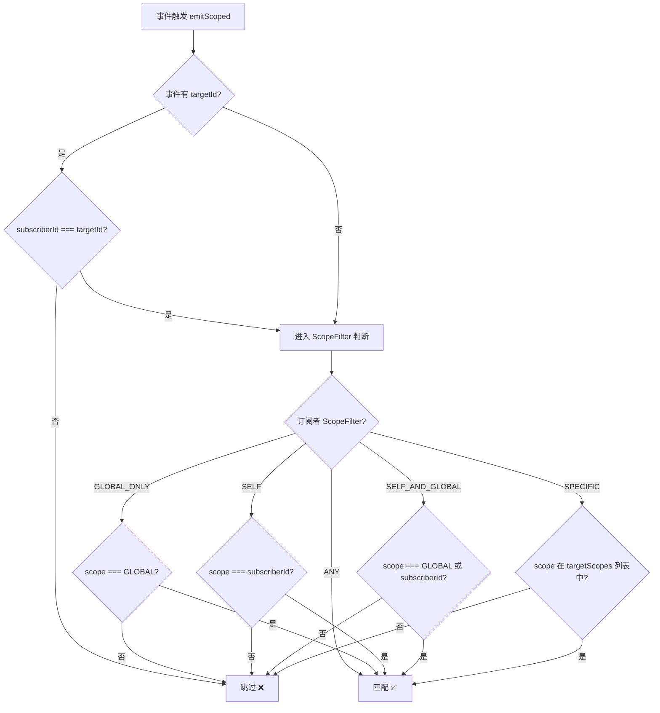
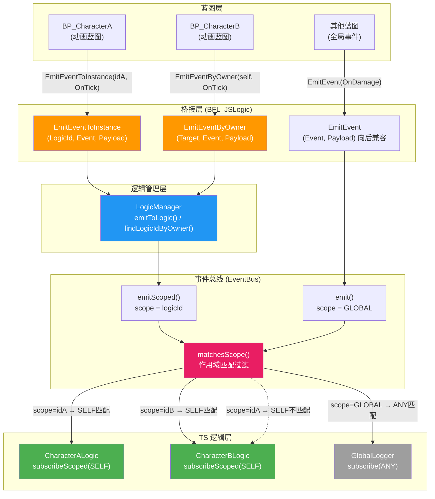
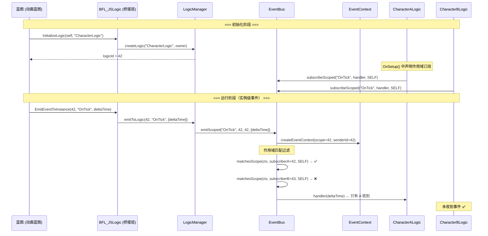
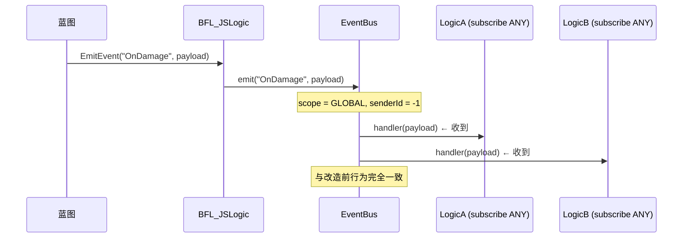
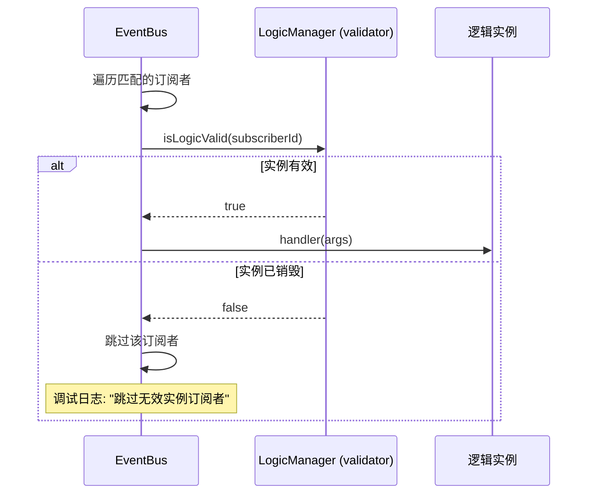

## 事件系统实例隔离（Event Instance Isolation）

本功能为 EventBus 事件系统新增**实例级事件隔离能力**，使每个逻辑实例能够精确控制自己接收哪些作用域的事件，明确知道"是谁在更新"。在保持全局事件能力的前提下，解决高频事件（如动画蓝图 OnTick）的全局广播问题。原有不受控全局 API（`on()`/`off()`/`emit()`/`once()`/`clear()`/`subscribe()`）已被**彻底删除**，所有事件操作必须使用作用域化 API。

相关源码：

- [EventContext.ts](../Scripts/Mixin/EventContext.ts)：事件上下文核心类型、作用域协议、匹配规则
- [EventBus.ts](../Scripts/Mixin/EventBus.ts)：事件总线（支持全局 + 实例级分发）
- [GameObjectBase.ts](../Scripts/Mixin/GameObjectBase.ts)：逻辑基类（支持作用域化订阅和发送）
- [LogicManager.ts](../Scripts/Mixin/LogicManager.ts)：逻辑管理器（实例级事件发送、有效性校验）
- [BP_JSBridge_Mixin.ts](../Scripts/Mixin/BP_JSBridge_Mixin.ts)：蓝图桥接层（实例级蓝图函数）

## 背景：为什么需要实例隔离

在原有架构中，蓝图通过 `EmitEvent("OnTick", deltaTime)` 触发事件，EventBus 将其**全局广播**给所有订阅者。这在大多数场景下工作良好，但对于以下场景会产生问题：

- **动画蓝图**：每个角色的动画蓝图都在 Event Blueprint Update Animation 中 `EmitEvent("OnTick")`，但 TS 侧**所有**订阅了 OnTick 的逻辑都会收到**所有**角色的 Tick，无法区分"这次 Tick 是谁的"
- **多实例同名事件**：场景中有 50 个怪物，每个怪物触发 `EmitEvent("OnDamage")`，所有怪物的伤害逻辑都会被**重复执行**
- **高频事件性能**：全局广播 + 无过滤 = 不必要的 handler 调用开销

```
改造前（全局广播）：
┌────────────┐     ┌──────────┐     ┌────────────────┐
│ 角色A OnTick│──→  │ EventBus │──→  │ 所有 OnTick    │  ← 角色B的逻辑也收到了
│ 角色B OnTick│──→  │ (全局)   │──→  │ 订阅者都收到    │  ← 无法区分来源
└────────────┘     └──────────┘     └────────────────┘

改造后（实例隔离）：
┌────────────┐     ┌──────────┐     ┌────────────────┐
│ 角色A OnTick│──→  │ EventBus │──→  │ 仅角色A的逻辑  │  ← 作用域匹配
│ 角色B OnTick│──→  │ (作用域) │──→  │ 仅角色B的逻辑  │  ← 精确分发
└────────────┘     └──────────┘     └────────────────┘
```

## 核心概念

### 事件作用域（EventScope）

每个事件触发时都携带一个**作用域标识**，标明事件的生效范围：

| 作用域 | 值 | 含义 |
| --- | --- | --- |
| 全局作用域 | `"__global__"` | 面向所有订阅者广播（旧行为） |
| 实例作用域 | `logicId`（数字） | 仅面向特定逻辑实例 |

### 事件上下文（EventContext）

每次事件触发时自动构建的上下文对象，携带完整的发送者信息：

| 字段 | 类型 | 说明 |
| --- | --- | --- |
| `eventName` | `string` | 事件名称 |
| `senderId` | `number` | 发送者 logicId（-1 表示非逻辑实例，如蓝图直接广播） |
| `scope` | `EventScope` | 事件作用域 |
| `payload` | `any[]` | 原始负载参数 |
| `timestamp` | `number` | 触发时间戳（毫秒） |
| `targetId?` | `number` | 可选：点对点投递的目标实例 |
| `isHighFrequency?` | `boolean` | 可选：高频事件标记（调试日志可选择性跳过） |

### 作用域过滤策略（ScopeFilter）

订阅者在订阅时声明自己关心哪些作用域的事件：

| 策略 | 枚举值 | 含义 | 适用场景 |
| --- | --- | --- | --- |
| 仅自身 | `ScopeFilter.SELF` | 只接收 scope === 自身 logicId 的事件 | 动画蓝图 OnTick |
| 仅全局 | `ScopeFilter.GLOBAL_ONLY` | 只接收全局广播事件 | 仅关心全局通知的逻辑 |
| 自身+全局 | `ScopeFilter.SELF_AND_GLOBAL` | 接收全局 + 自身实例的事件 | **默认策略**，大多数业务逻辑 |
| 全部 | `ScopeFilter.ANY` | 接收所有事件（不过滤） | 向后兼容、监控/日志系统 |
| 指定实例 | `ScopeFilter.SPECIFIC` | 接收指定 logicId 列表的事件 | 监听特定其他实例 |

### 作用域匹配流程



## 架构概要



## 事件分发流程

### 实例级事件分发



### 全局事件分发（向后兼容）



## 向后兼容与迁移说明

原有的不受控全局 API（`on()`/`off()`/`emit()`/`once()`/`emitImmediate()`/`clear()`）以及 `GameObjectBase.subscribe()` **已被彻底删除**。所有事件操作必须使用作用域化 API。

蓝图侧的 `EmitEvent()` 和 `EmitEventImmediate()` 函数**仍然保留**，其内部已自动使用新的作用域化 API（`emitScoped`/`emitImmediateScoped`），蓝图调用方无感知变化。

| 已删除接口 | 替代方案 |
| --- | --- |
| `EventBus.on()` | `EventBus.onScoped()` |
| `EventBus.off()` | `EventBus.offBySubscription()` / `offBySubscriberId()` |
| `EventBus.emit()` | `EventBus.emitScoped()` |
| `EventBus.emitImmediate()` | `EventBus.emitImmediateScoped()` |
| `EventBus.once()` | `EventBus.onScoped()` + 手动取消订阅 |
| `EventBus.clear()` | `offBySubscriberId()` / `clearEvent()` / `clearForTest()`（仅测试） |
| `GameObjectBase.subscribe()` | `GameObjectBase.subscribeScoped()` |

## API 参考

### EventContext.ts（事件上下文）

#### 常量

| 常量 | 值 | 说明 |
| --- | --- | --- |
| `GLOBAL_SCOPE` | `"__global__"` | 全局作用域标识 |

#### 枚举

| 枚举 | 值 | 说明 |
| --- | --- | --- |
| `ScopeFilter.SELF` | `"self"` | 仅接收自身实例作用域的事件 |
| `ScopeFilter.GLOBAL_ONLY` | `"global_only"` | 仅接收全局事件 |
| `ScopeFilter.SELF_AND_GLOBAL` | `"self_and_global"` | 接收全局 + 自身实例的事件（默认） |
| `ScopeFilter.ANY` | `"any"` | 接收所有事件（不过滤，向后兼容） |
| `ScopeFilter.SPECIFIC` | `"specific"` | 接收指定实例作用域的事件 |

#### 工具函数

| 函数 | 参数 | 返回值 | 说明 |
| --- | --- | --- | --- |
| `createEventContext` | `eventName, senderId, scope, payload, options?` | `EventContext` | 构建事件上下文对象 |
| `matchesScope` | `ctx, subscriberId, scopeOptions` | `boolean` | 判断订阅者是否应接收该事件 |
| `buildScopedKey` | `eventName, scope` | `string` | 构建作用域化的内部键（如 `"OnTick@42"`） |

---

### EventBus（事件总线）API

> 原有 `on()`/`off()`/`emit()`/`once()`/`clear()` 等接口已删除。

#### 作用域化订阅

| 方法 | 参数 | 返回值 | 说明 |
| --- | --- | --- | --- |
| `onScoped` | `eventName, subscriberId, handler, scopeOptions?, priority?` | `EventSubscription` | 作用域化订阅事件 |
| `offBySubscriberId` | `subscriberId: number` | `void` | 移除指定 logicId 的所有订阅（实例销毁时调用） |

#### 作用域化发送

| 方法 | 参数 | 返回值 | 说明 |
| --- | --- | --- | --- |
| `emitScoped` | `eventName, senderId, scope, args, options?` | `void` | 作用域化触发事件 |
| `emitImmediateScoped` | `eventName, senderId, scope, args, options?` | `void` | 作用域化立即触发（跳过节流/批处理） |

#### 实例级节流/批处理

| 方法 | 参数 | 返回值 | 说明 |
| --- | --- | --- | --- |
| `setScopedThrottle` | `eventName, scope, intervalMs` | `void` | 为指定事件+实例设置节流 |
| `removeScopedThrottle` | `eventName, scope` | `void` | 移除实例级节流 |
| `setScopedBatch` | `eventName, scope, windowMs` | `void` | 为指定事件+实例设置批处理 |
| `removeScopedConfigsByScope` | `scope: number` | `void` | 移除某实例的所有实例级配置 |

#### 调试

| 方法 | 参数 | 返回值 | 说明 |
| --- | --- | --- | --- |
| `setDebugMode` | `enabled, suppressHighFrequency?` | `void` | 开关调试日志 |
| `setInstanceValidator` | `validator: (logicId) => boolean` | `void` | 注册实例有效性校验函数 |
| `getSubscriberCount` | `eventName, subscriberId` | `number` | 获取指定实例在某事件上的订阅数 |
| `debugPrintStatus` | - | `void` | 打印完整的事件总线状态 |

---

### GameObjectBase（逻辑基类）API

> 原有 `subscribe()` 方法已删除。

| 方法 | 参数 | 说明 |
| --- | --- | --- |
| `subscribeScoped` | `eventName, handler, scopeOptions, priority?` | 作用域化订阅事件 |
| `emitAsInstance` | `eventName, ...args` | 以自身实例为作用域发送事件 |
| `emitGlobal` | `eventName, ...args` | 发送全局事件 |
| `isValid()` | - | 返回实例是否仍然有效（未销毁） |

**生命周期保护**：

| 保护机制 | 说明 |
| --- | --- |
| `_initialized` 标记 | 防止重复初始化导致重复订阅 |
| `_destroyed` 标记 | 防止销毁后继续订阅或接收事件 |
| `Destroy()` 自动清理 | 逐个取消订阅 + `offBySubscriberId` 安全网 + 清理实例级配置 |

---

### LogicManager（逻辑管理器）新增 API

| 方法 | 参数 | 返回值 | 说明 |
| --- | --- | --- | --- |
| `emitToLogic` | `logicId, eventName, args, options?` | `void` | 向指定实例发送实例级事件 |
| `emitGlobal` | `eventName, ...args` | `void` | 全局广播事件 |
| `findLogicIdByOwner` | `owner: UE.Object` | `number` | 根据 Owner 查找 logicId（未找到返回 -1） |
| `isLogicValid` | `logicId: number` | `boolean` | 检查实例是否存在且有效 |

---

### BFL_JSLogic（蓝图函数库）新增函数

| 蓝图函数 | 参数 | 说明 |
| --- | --- | --- |
| `EmitEventToInstance` | `LogicId: Integer, EventName: String, Payload: String` | 向指定 logicId 的实例发送事件 |
| `EmitEventByOwner` | `Target: Object, EventName: String, Payload: String` | 按 Owner 自动定位实例发送事件（找不到则降级为全局广播） |
| `SetInstanceEventThrottle` | `LogicId: Integer, EventName: String, IntervalMs: Integer` | 配置实例级事件节流 |
| `SetEventDebugMode` | `Enabled: Boolean` | 开关调试日志模式 |

## 使用指南

### 一、动画蓝图实例级 OnTick（核心用例）

这是本次改造最主要的使用场景：动画蓝图的 Event Graph 中使用 `InitializeLogic` 创建逻辑，然后通过实例级事件发送 OnTick，确保每个角色的动画逻辑只接收自身的 Tick。

#### 蓝图侧

```
Event Graph:
  ┌─────────────────────────────────────────────────────────┐
  │ Initialize Animation                                     │
  │   → InitializeLogic(self, "AnimBPLogic")                │
  │   → 保存返回值到变量 LogicId                             │
  └─────────────────────────────────────────────────────────┘

  ┌─────────────────────────────────────────────────────────┐
  │ Event Blueprint Update Animation (DeltaTime)            │
  │                                                         │
  │   方式1（推荐）：                                        │
  │   → EmitEventToInstance(LogicId, "OnAnimTick", DeltaTime)│
  │                                                         │
  │   方式2（自动查找）：                                    │
  │   → EmitEventByOwner(self, "OnAnimTick", DeltaTime)     │
  └─────────────────────────────────────────────────────────┘
```

> **方式1 vs 方式2**：
> - `EmitEventToInstance` 需要保存 LogicId 变量，性能最优（O(1) 直接定位）
> - `EmitEventByOwner` 不需要保存 LogicId，但每次需遍历查找 Owner 对应的逻辑实例（O(n)）

#### TS 侧

```ts
import { GameObjectBase } from "../Mixin/GameObjectBase";
import { ScopeFilter } from "../Mixin/EventContext";

export class AnimBPLogic extends GameObjectBase {
    protected OnSetup(): void {
        // 使用 SELF 过滤：只接收发给自身实例的 OnAnimTick
        this.subscribeScoped(
            "OnAnimTick",
            this.onAnimTick.bind(this),
            { filter: ScopeFilter.SELF }
        );
    }

    private onAnimTick(deltaTime: number): void {
        // 这里只会收到自身动画蓝图实例的 Tick
        // 可以安全地更新动画参数
        const owner = this.getOwnerAs<UE.AnimInstance>();
        if (!owner) return;

        // 设置动画变量、切换状态等
        console.log(`[AnimBP] logicId=${this.logicId}, dt=${deltaTime}`);
    }
}
```

---

### 二、作用域化订阅策略

根据不同的业务需求，选择合适的 `ScopeFilter`：

#### SELF — 仅接收自身实例的事件

```ts
// 动画蓝图逻辑：只关心自己的 Tick
this.subscribeScoped("OnAnimTick", this.onTick.bind(this), {
    filter: ScopeFilter.SELF,
});
```

#### SELF_AND_GLOBAL — 接收自身 + 全局事件（默认策略）

```ts
// 角色逻辑：接收自身的实例事件 + 全局广播事件
this.subscribeScoped("OnDamage", this.onDamage.bind(this), {
    filter: ScopeFilter.SELF_AND_GLOBAL,
});
```

#### GLOBAL_ONLY — 仅接收全局事件

```ts
// UI 逻辑：只关心全局通知，不关心特定实例
this.subscribeScoped("OnGamePause", this.onPause.bind(this), {
    filter: ScopeFilter.GLOBAL_ONLY,
});
```

#### ANY — 接收所有事件（向后兼容）

```ts
// 接收所有事件（日志系统用途）
this.subscribeScoped("OnDamage", this.logDamage.bind(this), {
    filter: ScopeFilter.ANY,
});
```

#### SPECIFIC — 监听指定实例的事件

```ts
// 监听特定队友（logicId = 10 和 11）的状态
this.subscribeScoped("OnHealthChanged", this.onTeammateHealth.bind(this), {
    filter: ScopeFilter.SPECIFIC,
    targetScopes: [10, 11],
});
```

---

### 三、从逻辑实例发送事件

在 `GameObjectBase` 子类中，有两种发送方式：

#### 发送实例级事件

```ts
// 以自身为作用域发送事件（只有订阅了 SELF/SELF_AND_GLOBAL/ANY 且 logicId 匹配的订阅者会收到）
this.emitAsInstance("OnHealthChanged", { hp: this.hp, maxHp: 100 });
```

#### 发送全局事件

```ts
// 全局广播（所有订阅者都会收到，与旧的 EventBus.emit() 行为一致）
this.emitGlobal("OnBossDefeated", { bossName: "Dragon" });
```

---

### 四、实例级节流

对高频事件（如动画 OnTick）配置实例级节流，不影响其他实例：

#### TS 侧

```ts
import { EventBus } from "../Mixin/EventBus";

export class AnimBPLogic extends GameObjectBase {
    protected OnSetup(): void {
        this.subscribeScoped("OnAnimTick", this.onTick.bind(this), {
            filter: ScopeFilter.SELF,
        });

        // 仅对自身实例的 OnAnimTick 设置节流（约 30fps）
        // 不影响其他角色的 OnAnimTick 频率
        EventBus.getInstance().setScopedThrottle("OnAnimTick", this.logicId, 33);
    }
}
```

#### 蓝图侧

```
BeginPlay:
    InitializeLogic(self, "AnimBPLogic") → LogicId
    SetInstanceEventThrottle(LogicId, "OnAnimTick", 33)
```

> **实例级节流 vs 全局级节流**：
> - `setThrottle("OnAnimTick", 33)` — 全局节流，所有 OnAnimTick 事件共享同一个时间窗口
> - `setScopedThrottle("OnAnimTick", logicId, 33)` — 实例级节流，每个实例独立计时，互不影响

---

### 五、实例有效性校验

EventBus 在分发事件时会自动校验订阅者实例是否仍然有效（由 `LogicManager` 在构造时注册校验函数）：



**自动生命周期管理**：
- `GameObjectBase.Init()` 设置 `_initialized = true, _destroyed = false`
- `GameObjectBase.Destroy()` 设置 `_destroyed = true`，自动取消所有订阅 + 清理实例级配置
- 销毁后尝试订阅会被阻止并输出警告
- 重复初始化 / 重复销毁会被阻止并输出警告

---

### 六、调试模式

开启调试模式后，EventBus 会输出详细的事件分发日志：

#### TS 侧

```ts
EventBus.getInstance().setDebugMode(true);
// 或者抑制高频事件日志（推荐，避免日志洪泛）
EventBus.getInstance().setDebugMode(true, true);
```

#### 蓝图侧

```
SetEventDebugMode(true)
```

**调试日志示例**：

```
[EventBus][DEBUG] 订阅: event=OnAnimTick, subscriberId=42, filter=self, priority=0
[EventBus][DEBUG] 分发完成: event=OnDamage, scope=42, senderId=42, 匹配=1/3
[EventBus][DEBUG] 跳过无效实例订阅者: event=OnTick, subscriberId=99
[EventBus][DEBUG] 事件无订阅者: event=OnUnused, scope=__global__, senderId=-1
```

#### 状态打印

```ts
EventBus.getInstance().debugPrintStatus();
```

输出：
```
===== EventBus 状态 =====
调试模式: true
注册事件数: 3
  OnAnimTick: 2 个订阅者 [sub=42:self, sub=43:self]
  OnDamage: 1 个订阅者 [sub=42:self_and_global]
  OnGamePause: 1 个订阅者 [sub=-1:any]
全局级节流: 1 个
实例级节流: 2 个
全局级批处理: 0 个
实例级批处理: 0 个
================================
```

## 完整蓝图函数库 API 速查

包含原有函数和新增函数的完整列表：

| 蓝图函数 | 参数 | 返回值 | 说明 | 状态 |
| --- | --- | --- | --- | --- |
| `InitializeLogic` | `Target: Object, LogicTypeName: String` | `Integer` | 创建逻辑实例，返回 LogicId | 原有 |
| `DestroyLogic` | `LogicId: Integer` | `void` | 销毁逻辑实例 | 原有 |
| `EmitEvent` | `EventName: String, Payload: String` | `void` | 触发全局事件（应用节流/批处理） | 原有 |
| `EmitEventImmediate` | `EventName: String, Payload: String` | `void` | 强制立即触发全局事件 | 原有 |
| `SetEventThrottle` | `EventName: String, IntervalMs: Integer` | `void` | 配置全局级事件节流 | 原有 |
| `SetEventBatch` | `EventName: String, WindowMs: Integer` | `void` | 配置全局级事件批处理 | 原有 |
| `EmitEventToInstance` | `LogicId: Integer, EventName: String, Payload: String` | `void` | 向指定实例发送事件 | **新增** |
| `EmitEventByOwner` | `Target: Object, EventName: String, Payload: String` | `void` | 按 Owner 自动定位实例发送事件 | **新增** |
| `SetInstanceEventThrottle` | `LogicId: Integer, EventName: String, IntervalMs: Integer` | `void` | 配置实例级事件节流 | **新增** |
| `SetEventDebugMode` | `Enabled: Boolean` | `void` | 开关调试日志模式 | **新增** |

## 迁移指南

### 从全局 OnTick 迁移到实例级 OnTick

**改造前（全局广播）**：

蓝图侧：
```
Event Tick:
    EmitEvent("OnTick", DeltaTime)
```

TS 侧：
```ts
protected OnSetup(): void {
    this.subscribe("OnTick", this.onTick.bind(this));
}
```

**改造后（实例级隔离）**：

蓝图侧：
```
BeginPlay:
    InitializeLogic(self, "MyLogic") → LogicId

Event Tick:
    EmitEventToInstance(LogicId, "OnTick", DeltaTime)
```

TS 侧：
```ts
protected OnSetup(): void {
    this.subscribeScoped("OnTick", this.onTick.bind(this), {
        filter: ScopeFilter.SELF,
    });
}
```

### 渐进式迁移策略

不需要一次性迁移所有事件。建议按优先级逐步迁移：

1. **优先迁移**：高频事件（OnTick、OnAnimTick）和多实例场景（怪物、弹幕）
2. **可选迁移**：中频事件（OnDamage、OnCollision）
3. **暂不迁移**：低频全局事件（OnGameStart、OnLevelUp）— 全局广播完全够用

> 旧代码使用 `subscribe()` + `EmitEvent()` 的组合**已不再编译通过**，必须迁移为 `subscribeScoped()` + 新的发送 API。

## ~~已废弃 API 清单~~（已彻底删除）

以下接口已从代码中**彻底移除**，不再可用：

### EventBus 已删除方法

| 已删除方法 | 替代方案 |
| --- | --- |
| `on(eventName, handler, priority?)` | `onScoped(eventName, subscriberId, handler, scopeOptions, priority?)` |
| `off(eventName, handler)` | `offBySubscription(subscription)` 或 `offBySubscriberId(subscriberId)` |
| `emit(eventName, ...args)` | `emitScoped(eventName, senderId, scope, args, options?)` |
| `emitImmediate(eventName, ...args)` | `emitImmediateScoped(eventName, senderId, scope, args, options?)` |
| `once(eventName, handler, priority?)` | `onScoped()` + 手动取消订阅 |
| `clear()` | `offBySubscriberId()` / `clearEvent()` / `clearForTest()` |

### GameObjectBase 已删除方法

| 已删除方法 | 替代方案 |
| --- | --- |
| `subscribe(eventName, handler, priority?)` | `subscribeScoped(eventName, handler, scopeOptions, priority?)` |

## 总结

事件系统实例隔离的核心设计是**在不破坏现有 API 的前提下，为事件系统增加作用域维度**：

- **事件上下文（EventContext）**：每次 emit 自动构建，携带 senderId、scope、timestamp 等信息
- **作用域过滤（ScopeFilter）**：订阅者声明关心哪些作用域，EventBus 自动匹配过滤
- **实例有效性校验**：分发时自动跳过已销毁的实例，避免野指针回调
- **实例级节流/批处理**：每个实例独立计时，互不影响
- **双重生命周期保护**：`_initialized` + `_destroyed` 标记，防止重复操作
- **已删除旧 API**：`on()`/`off()`/`emit()`/`once()`/`clear()`/`subscribe()` 已彻底移除
- **全面作用域化**：所有事件操作必须使用作用域化 API（`onScoped`/`emitScoped`/`subscribeScoped` 等）
