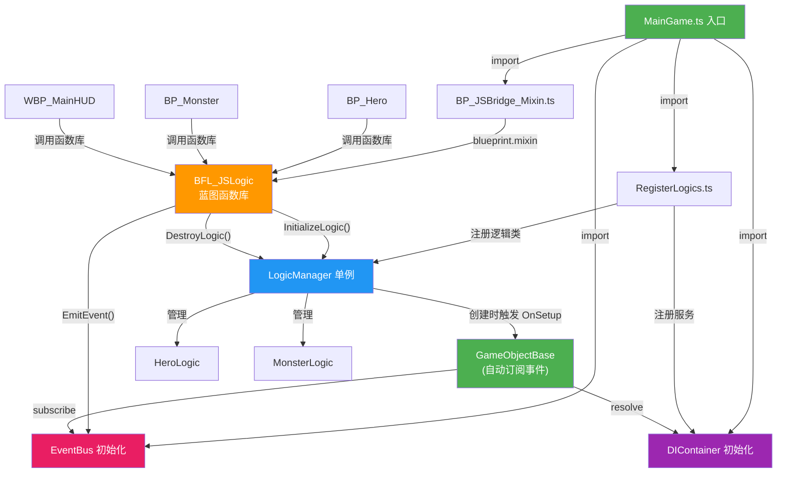
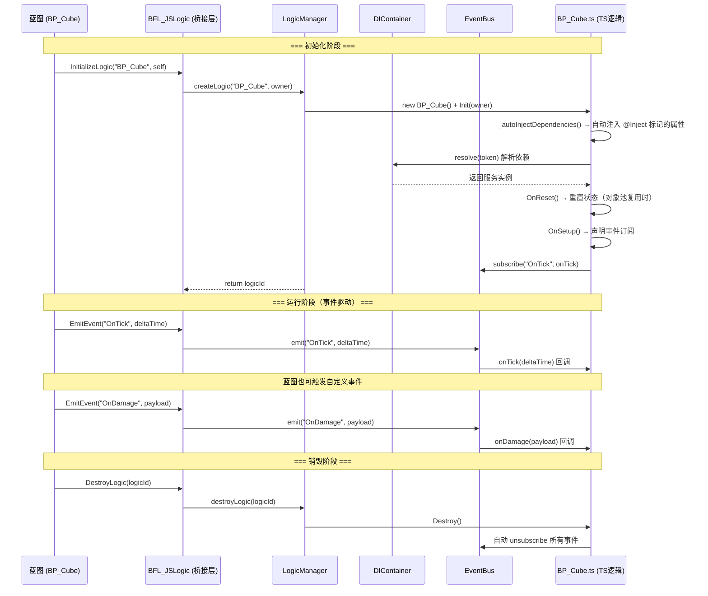

## Mixin 逻辑分发方案概述

本方案的核心目标是：**只保留一个稳定的 Mixin 注入点，把具体蓝图实例的游戏逻辑从蓝图类本身剥离出来，统一交给 TypeScript 逻辑管理器托管**。

在当前实现中，蓝图侧通过一个统一的蓝图函数库调用 `InitializeLogic`、`EmitEvent`、`DestroyLogic`，再由 TypeScript 中的 `LogicManager` 创建和销毁对应的逻辑实例，由 `EventBus` 进行事件分发。这样一来，真正承载业务逻辑的是纯 TS 类，而不是直接挂在某个蓝图类上的 Mixin 实现。

相关源码：

- [BP_JSBridge_Mixin.ts](../Scripts/Mixin/BP_JSBridge_Mixin.ts)：统一蓝图分发入口
- [LogicManager.ts](../Scripts/Mixin/LogicManager.ts)：逻辑实例管理器
- [GameObjectBase.ts](../Scripts/Mixin/GameObjectBase.ts)：所有 TS 逻辑的基类（支持事件订阅和依赖注入）
- [EventBus.ts](../Scripts/Mixin/EventBus.ts)：事件总线（发布/订阅系统）
- [EventTypes.ts](../Scripts/Mixin/EventTypes.ts)：事件类型常量定义
- [DIContainer.ts](../Scripts/Mixin/DIContainer.ts)：轻量级依赖注入容器
- [RegisterLogics.ts](../Scripts/Logic/RegisterLogics.ts)：逻辑类型和服务注册入口
- [BP_Cube.ts](../Scripts/Logic/BP_Cube.ts)：一个逻辑类示例

## 架构概要

本方案采用 **事件驱动架构（Event-Driven Architecture）** + **轻量依赖注入（DI Container）**：

- **事件总线 `EventBus`**：替代原来蓝图每帧轮询 `UpdateLogic` 的方式，蓝图只需通过 `EmitEvent` 触发事件，TS 逻辑被动响应
- **DI 容器 `DIContainer`**：管理 TS 层轻量服务和 UE Subsystem 包装层，逻辑类可通过 `@Inject` 装饰器或 `this.resolve<T>(token)` 便捷访问
- **逻辑管理器 `LogicManager`**：仅负责逻辑实例的创建和销毁，不再承担每帧更新职责

### 架构分层

```
┌──────────────────────────────────────────────────────────┐
│  UE Subsystem 层（C++/蓝图）                              │
│  背包系统、存档系统、成就系统、任务系统等                     │
│  （状态持久化、数据管理、引擎深度交互）                       │
│  使用 UGameInstanceSubsystem / UWorldSubsystem 等         │
└──────────────────┬───────────────────────────────────────┘
                   │ 通过 DIContainer 注册包装层
                   ▼
┌──────────────────────────────────────────────────────────┐
│  TS Mixin 层（当前框架）                                   │
│  GameObjectBase + EventBus + DIContainer                  │
│  - Actor 级别的行为逻辑（旋转、移动、特效触发等）             │
│  - UI 交互逻辑                                             │
│  - 事件驱动的响应式逻辑                                     │
│  - 通过 @Inject 访问 UE Subsystem 包装层                   │
└──────────────────────────────────────────────────────────┘
```



## 背景：原生 Mixin 的问题

原生做法通常是：**每个需要逻辑的蓝图类都分别做一次 Mixin 注入**。

这种方式在编辑器里看起来很直接，但在实际项目里，尤其是**打包后的运行环境**下，会遇到一个关键问题：

- **切换地图时会触发 GC**
- 一些蓝图实例或相关对象在 GC 后会被重新创建
- 之前注入到这些蓝图类或实例关联链路上的 Mixin 逻辑，可能出现**失效、丢失或需要重新注入**的问题

这会带来几个明显后果：

- **重复注入带来额外性能开销**
- **逻辑生命周期分散，不好统一管理**
- **对象销毁与重建后，逻辑状态恢复复杂**
- **蓝图类型越多，维护成本越高**
- **Actor、UserWidget、Component 等不同蓝图类型难以复用同一套接入方式**

## 事件驱动的调用流程



## 各层职责说明

### EventBus（事件总线）
- 轻量级发布/订阅系统
- 提供 `on`/`off`/`emit`/`once`/`clear` 方法
- 支持事件优先级（`EventPriority`），高优先级处理器先执行
- 替代原来的每帧轮询，实现事件驱动

### DIContainer（依赖注入容器）
- 轻量实现，不依赖 reflect-metadata，适合 puerts 环境
- 支持 Singleton（单例）和 Transient（瞬态）两种生命周期
- 通过 `register`/`resolve` 管理服务依赖
- **定位**：TS 层内部轻量工具服务 + UE C++ Subsystem 的 TS 包装层
- 系统级功能（背包、存档、任务等）建议用 UE Subsystem 实现，在此容器中注册其 TS 包装

### GameObjectBase（逻辑基类）
- `@Inject(token)` 装饰器：标记属性自动注入，`Init()` 时自动从 DI 容器解析赋值
- `OnSetup()` 钩子：子类在此声明事件订阅（此时 `@Inject` 标记的属性已就绪）
- `subscribe(event, handler, priority?)`：订阅事件（支持优先级），自动在 Destroy 时取消
- `resolve<T>(token)` / `tryResolve<T>(token)`：手动从 DI 容器获取服务
- `Destroy()` 时自动清理所有事件订阅

### LogicManager（逻辑管理器）
- 仅负责逻辑实例的创建和销毁（不再承担每帧更新）
- 维护 logicId → 逻辑实例的映射

### BP_JSBridge_Mixin（桥接层）
- `InitializeLogic(Target, LogicTypeName)` → 创建逻辑
- `EmitEvent(EventName, Payload)` → 触发事件（新增）
- `DestroyLogic(LogicId)` → 销毁逻辑

## 方案对比

| 维度 | 当前事件驱动方案 | 原 UpdateLogic 轮询方案 |
| --- | --- | --- |
| 更新机制 | 事件驱动，按需响应 | 每帧轮询所有逻辑 |
| 性能 | 只有订阅 OnTick 的逻辑才有开销 | 所有逻辑每帧都被调用 |
| 扩展性 | 支持自定义事件（OnDamage 等） | 仅支持每帧 Update |
| 解耦程度 | 逻辑间通过事件通信，完全解耦 | 逻辑间无直接通信机制 |
| 依赖管理 | DI 容器统一管理（含 UE Subsystem 包装） | 手动传递依赖 |
| 蓝图侧改动 | 删除 UpdateLogic，新增 EmitEvent | 三个固定函数 |

## 为什么这个方案能规避原生方案的问题

关键点在于：**把"注入点"和"业务逻辑承载点"分开了**。

原生方案的问题是，业务逻辑直接依附在多个蓝图类的 Mixin 上；一旦地图切换、GC、对象重建等情况发生，就可能需要重新处理这些分散的注入关系。

而现在：

- Mixin 只保留在一个统一入口上
- 业务逻辑实例是纯 TS 对象
- 生命周期由 `LogicManager` 统一管理
- 蓝图只是通过 `logicId` 与逻辑实例关联

因此，即便地图切换场景下存在 GC，系统需要维护的也只是：

- 统一桥接入口是否可用
- 哪些逻辑实例需要创建
- 哪些逻辑实例需要销毁

而不是为每个蓝图类型分别恢复一套独立的注入逻辑。

## 新功能使用指南

### 一、事件节流（Throttle）

事件节流用于限制高频事件（如 OnTick）的实际触发频率，减少 TS 层处理压力。

#### TS 侧

在逻辑类的 `OnSetup()` 中订阅事件后，通过 `EventBus` 设置节流：

```ts
import { EventBus } from "../Mixin/EventBus";
import { EventTypes } from "../Config/EventTypes";

export class BP_Cube extends GameObjectBase {
    protected OnSetup(): void {
        this.subscribe(EventTypes.OnTick, this.OnTick.bind(this));
        // 设置 OnTick 事件节流：最少每 33ms 触发一次（约 30fps）
        EventBus.getInstance().setThrottle(EventTypes.OnTick, 33);
    }

    private OnTick(deltaTime: number): void {
        // 此回调实际执行频率被限制在约 30fps
    }
}
```

**节流 API**：

| 方法 | 说明 |
| --- | --- |
| `setThrottle(eventName, intervalMs)` | 设置节流间隔（毫秒） |
| `removeThrottle(eventName)` | 移除节流 |

**节流工作原理**：
- 首次触发立即放行
- 后续将 `deltaTime`（秒）累加为毫秒，累计 ≥ 间隔时触发
- 触发后累计时间取模保留超出部分，减少边界抖动
- 被节流期间记录最新参数，确保不丢失尾调用

#### 蓝图侧

在蓝图中通过函数库 `BFL_JSLogic` 配置节流：

| 蓝图函数 | 参数 | 说明 |
| --- | --- | --- |
| `SetEventThrottle` | `EventName`: String, `IntervalMs`: Integer | 为指定事件设置节流间隔 |
| `EmitEvent` | `EventName`: String, `Payload`: String | 正常触发事件（自动应用节流） |
| `EmitEventImmediate` | `EventName`: String, `Payload`: String | 强制立即触发（跳过节流） |

**蓝图节点示例**：

```
BeginPlay:
    SetEventThrottle("OnTick", 33)    ← 设置 OnTick 事件 33ms 节流

Event Tick (DeltaTime):
    EmitEvent("OnTick", DeltaTime)    ← 每帧调用，但 TS 层实际约 30fps 处理
```

---

### 二、事件批处理（Batch）

批处理用于将一段时间窗口内的多次事件触发合并为一次，订阅者收到的是事件参数数组。

#### TS 侧

```ts
// 设置碰撞事件批处理：100ms 窗口内的碰撞合并为一次处理
EventBus.getInstance().setBatch(EventTypes.OnCollision, 100);
```

订阅者的 handler 签名变为：

```ts
// 普通事件：handler(payload)
// 批处理事件：handler(batchedArgs: any[][])
private OnCollisionBatch(batchedArgs: any[][]): void {
    console.log(`本批次收到 ${batchedArgs.length} 次碰撞`);
    for (const args of batchedArgs) {
        // args 是每次碰撞的原始参数
    }
}
```

**批处理 API**：

| 方法 | 说明 |
| --- | --- |
| `setBatch(eventName, windowMs)` | 设置批处理窗口（毫秒） |
| `removeBatch(eventName, flush?)` | 移除批处理（flush=true 时立即刷新缓冲区） |

#### 蓝图侧

| 蓝图函数 | 参数 | 说明 |
| --- | --- | --- |
| `SetEventBatch` | `EventName`: String, `WindowMs`: Integer | 为指定事件设置批处理窗口 |

```
BeginPlay:
    SetEventBatch("OnCollision", 100)    ← 100ms 内的碰撞合并为一批
```

---

### 三、对象池（Object Pool）

对象池用于复用逻辑实例，避免频繁创建/销毁带来的性能开销。

#### TS 侧

在 [RegisterLogics.ts](../Scripts/Config/RegisterLogics.ts) 中注册逻辑类型时配置对象池：

```ts
const logicManager = LogicManager.getInstance();

// 默认配置：池容量=10, 懒加载=true, 预热=0
logicManager.registerLogicClass("BP_Cube", BP_Cube);

// 自定义配置：怪物频繁生成/销毁，池大，预热 5 个
logicManager.registerLogicClass("Monster", Monster, {
    maxSize: 20,       // 池最大容量
    lazyInit: false,   // 关闭懒加载，注册时立即预热
    prewarmCount: 5,   // 预创建 5 个实例放入池中
});

// UI 逻辑不需要池化
logicManager.registerLogicClass("MainHUD", MainHUD, {
    maxSize: 0,        // 0 = 不池化，每次创建新实例，销毁时直接丢弃
});
```

**池配置参数**：

| 参数 | 类型 | 默认值 | 说明 |
| --- | --- | --- | --- |
| `maxSize` | number | 10 | 池最大容量，超出则直接销毁不回收 |
| `lazyInit` | boolean | true | 是否懒加载（延迟到首次 createLogic 时才实例化） |
| `prewarmCount` | number | 0 | 预热数量（仅 lazyInit=false 时生效） |

**运行时 API**：

| 方法 | 说明 |
| --- | --- |
| `prewarm(typeName, count)` | 手动预热指定数量的实例 |
| `getPoolSize(typeName)` | 获取池中可用实例数量 |
| `getPoolConfig(typeName)` | 获取池配置 |
| `setPoolConfig(typeName, config)` | 动态修改池配置 |
| `destroyAll(clearPool?)` | 销毁所有逻辑实例（clearPool=true 同时清空池） |
| `debugPrintStatus()` | 打印管理器状态（调试用） |

**子类重写 `OnReset()` 以支持对象池复用**：

当实例从对象池中被复用时，`Init()` 会自动调用 `OnReset()` 重置状态：

```ts
export class Monster extends GameObjectBase {
    private hp: number = 100;
    private isAlive: boolean = true;

    // 从对象池复用时自动调用，重置为干净状态
    protected OnReset(): void {
        this.hp = 100;
        this.isAlive = true;
    }
}
```

#### 蓝图侧

蓝图无需任何改动。对象池对蓝图完全透明：
- `InitializeLogic` 内部自动优先从池中取出复用
- `DestroyLogic` 内部自动回收到池中（未满时）

---

### 四、依赖注入（DI Container）

DIContainer 的核心定位：
- **TS 层轻量工具服务**：配置读取器、公式计算器、事件名管理等纯 TS 逻辑
- **UE Subsystem 包装层**：将获取 C++ Subsystem 的样板代码封装一次，逻辑类复用
- **Mock 替换**：开发阶段用 Mock 实现替换真实服务

> **架构建议**：系统级功能（背包、存档、任务、AI 等）推荐使用 UE Subsystem (C++/蓝图) 实现，
> 然后在 DIContainer 中注册其 TS 包装层，供逻辑类通过 `@Inject` 或 `resolve()` 便捷访问。

#### TS 侧

**注册服务**（在 [RegisterLogics.ts](../Scripts/Config/RegisterLogics.ts) 中）：

```ts
import { DIContainer, Lifecycle } from "../Mixin/DIContainer";
const container = DIContainer.getInstance();

// --- TS 层轻量工具服务 ---
// 单例服务（默认），全局唯一实例
container.register("ConfigReader", () => new ConfigReader());

// 瞬态服务，每次 resolve 创建新实例
container.register("TempHelper", () => new TempHelper(), Lifecycle.Transient);

// 直接注册已有实例
container.registerInstance("GameConfig", myConfigObj);

// --- UE Subsystem 的 TS 包装层 ---
// 将获取 C++ Subsystem 的样板代码封装一次，逻辑类通过 @Inject 或 resolve 复用
container.register("InventorySystem", () => {
    const gi = UE.GameplayStatics.GetGameInstance(globalThis.__world);
    return UE.SubsystemBlueprintLibrary.GetGameInstanceSubsystem(
        gi, UE.BP_InventorySubsystem.StaticClass()
    ) as UE.BP_InventorySubsystem;
});
```

**方式一：`@Inject` 装饰器自动注入（推荐）**

使用 `@Inject(token)` 属性装饰器标记需要注入的属性，`Init()` 时自动从 DI 容器解析并赋值，无需手动调用 `resolve`：

```ts
import { Inject } from "../Mixin/DIContainer";

export class BP_Hero extends GameObjectBase {
    // 注入 UE Subsystem 包装层（在 RegisterLogics.ts 中注册）
    @Inject("InventorySystem")
    private inventory!: UE.BP_InventorySubsystem;

    // 注入 TS 层轻量服务
    @Inject("ConfigReader")
    private configReader!: ConfigReader;

    // 可选注入：服务不存在时为 undefined，不抛异常
    @Inject("AudioService", true)
    private audioService?: AudioService;

    protected OnSetup(): void {
        // @Inject 标记的属性在 OnSetup 之前已自动注入，可直接使用
        const hp = this.configReader.getValue("hp");
        this.inventory.AddItem("sword_01", 1);
        this.audioService?.playSound("spawn");
    }
}
```

**`@Inject` 装饰器特性**：

| 特性 | 说明 |
| --- | --- |
| 注入时机 | `Init()` 中，在 `OnReset()` 和 `OnSetup()` 之前执行 |
| 继承支持 | 沿原型链向上查找，父类的 `@Inject` 自动被子类继承 |
| 子类覆盖 | 子类和父类声明同名属性时，子类的 token 优先 |
| 可选注入 | `@Inject("token", true)` 服务不存在时为 `undefined` |
| 零开销 | 没有 `@Inject` 标记时直接跳过，无额外性能损耗 |
| 无外部依赖 | 不依赖 `reflect-metadata`，适配 puerts 环境 |

**方式二：手动 `resolve`（仍然可用）**

两种方式可混用，手动方式适合在运行时动态获取服务：

```ts
export class BP_Hero extends GameObjectBase {
    protected OnSetup(): void {
        // 手动获取 UE Subsystem 包装
        const inventory = this.resolve<UE.BP_InventorySubsystem>("InventorySystem");
        
        // 安全获取（不存在时返回 undefined）
        const audio = this.tryResolve<AudioService>("AudioService");
    }
}
```

#### 蓝图侧

DI 容器仅在 TS 侧使用，蓝图无需也无法直接调用。

---

### 五、事件优先级（Priority）

事件优先级用于控制同一事件的多个订阅者的执行顺序，确保关键逻辑优先响应。

#### TS 侧

**内置优先级常量** `EventPriority`：

| 常量 | 值 | 适用场景 |
| --- | --- | --- |
| `CRITICAL` | 200 | 系统级关键逻辑（伤害计算、状态校验、死亡判定） |
| `HIGH` | 100 | 重要游戏逻辑（技能释放、碰撞响应） |
| `NORMAL` | 0 | 默认优先级（普通业务逻辑） |
| `LOW` | -100 | 后台任务（日志记录、统计上报、UI 更新） |

也可以使用任意数值作为优先级，数值越大越先执行。

**在逻辑类中使用**：

```ts
import { EventPriority } from "../Mixin/EventBus";
import { EventTypes } from "../Config/EventTypes";

export class DamageSystem extends GameObjectBase {
    protected OnSetup(): void {
        // 伤害计算必须最先执行，使用 CRITICAL 优先级
        this.subscribe(
            EventTypes.OnDamage,
            this.onDamage.bind(this),
            EventPriority.CRITICAL
        );
    }

    private onDamage(payload: any): void {
        // 伤害计算逻辑（最先执行）
    }
}

export class DamageVFX extends GameObjectBase {
    protected OnSetup(): void {
        // 伤害特效在伤害计算之后执行
        this.subscribe(
            EventTypes.OnDamage,
            this.onDamageVFX.bind(this),
            EventPriority.NORMAL
        );
    }

    private onDamageVFX(payload: any): void {
        // 播放伤害特效（后执行）
    }
}

export class DamageLogger extends GameObjectBase {
    protected OnSetup(): void {
        // 日志记录最后执行
        this.subscribe(
            EventTypes.OnDamage,
            this.onDamageLog.bind(this),
            EventPriority.LOW
        );
    }

    private onDamageLog(payload: any): void {
        // 记录伤害日志（最后执行）
    }
}
```

**也可以直接通过 EventBus 使用**：

```ts
const bus = EventBus.getInstance();

// 高优先级订阅
bus.on("OnDamage", myHandler, EventPriority.HIGH);

// 自定义数值优先级
bus.on("OnDamage", anotherHandler, 50);

// 一次性高优先级订阅
bus.once("OnGameStart", initHandler, EventPriority.CRITICAL);

// 调试：查看某事件各监听器的优先级（按执行顺序排列）
const priorities = bus.getListenerPriorities("OnDamage");
console.log(priorities); // [200, 100, 50, 0, -100]
```

**优先级排序规则**：
- 数值越大优先级越高，越先执行
- 同优先级的处理器按订阅顺序执行（先订阅先执行，FIFO）
- 不指定优先级时默认为 `EventPriority.NORMAL`（0）
- 使用二分插入保持有序，订阅性能 O(log n)

#### 蓝图侧

事件优先级在 TS 侧通过 `subscribe` 的第三个参数配置，蓝图无需也无法直接设置优先级。蓝图只需正常调用 `EmitEvent` 触发事件，TS 侧的处理器会自动按优先级顺序执行。

---

### 六、自定义事件类型

#### TS 侧

在 [EventTypes.ts](../Scripts/Config/EventTypes.ts) 中添加新的事件常量：

```ts
export const EventTypes = {
    // ... 已有事件 ...

    /** 自定义：玩家升级 */
    OnLevelUp: "OnLevelUp",

    /** 自定义：拾取道具 */
    OnItemPickup: "OnItemPickup",
} as const;
```

在逻辑类中订阅和处理：

```ts
protected OnSetup(): void {
    this.subscribe(EventTypes.OnLevelUp, this.OnLevelUp.bind(this));
}

private OnLevelUp(data: { level: number; playerName: string }): void {
    console.log(`${data.playerName} 升级到 ${data.level}`);
}
```

#### 蓝图侧

在蓝图中通过 `EmitEvent` 触发自定义事件，Payload 使用 JSON 字符串：

```
EmitEvent("OnLevelUp", "{\"level\": 10, \"playerName\": \"Hero\"}")
```

> **提示**：蓝图中可使用 `Make JSON String` 或手动拼接 JSON 字符串。TS 桥接层会自动尝试 JSON.parse 解析 Payload。

---

### 七、完整蓝图函数库 API 速查

| 蓝图函数 | 参数 | 返回值 | 说明 |
| --- | --- | --- | --- |
| `InitializeLogic` | `Target`: Object, `LogicTypeName`: String | Integer (LogicId) | 创建逻辑实例，返回 LogicId |
| `DestroyLogic` | `LogicId`: Integer | void | 销毁逻辑实例（自动回收到对象池） |
| `EmitEvent` | `EventName`: String, `Payload`: String | void | 触发事件（自动应用节流/批处理） |
| `EmitEventImmediate` | `EventName`: String, `Payload`: String | void | 强制立即触发事件 |
| `SetEventThrottle` | `EventName`: String, `IntervalMs`: Integer | void | 配置事件节流 |
| `SetEventBatch` | `EventName`: String, `WindowMs`: Integer | void | 配置事件批处理 |

## 总结

这套方案并不是完全放弃 Mixin，而是把 Mixin 的职责**缩减为统一桥接层**，把真正复杂、易变、需要扩展的业务逻辑全部转移到 TypeScript 逻辑类与 `LogicManager` 中。

因此它更适合以下场景：

- 项目里有大量蓝图对象需要接入 TS 逻辑
- 存在地图切换、GC、对象频繁创建销毁
- 需要统一管理逻辑生命周期
- 希望同一套方案覆盖 Actor、UI、组件等不同蓝图类型

如果继续沿用原生逐蓝图 Mixin 方式，短期上手简单；但随着项目规模扩大，**GC、切图、维护成本和可扩展性问题会越来越明显**。当前这种"单点桥接 + 逻辑托管"的结构，更适合作为长期方案。