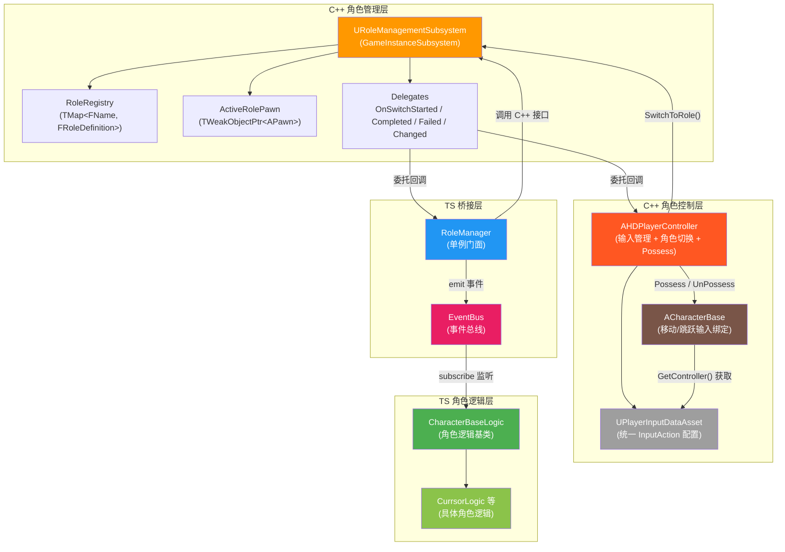
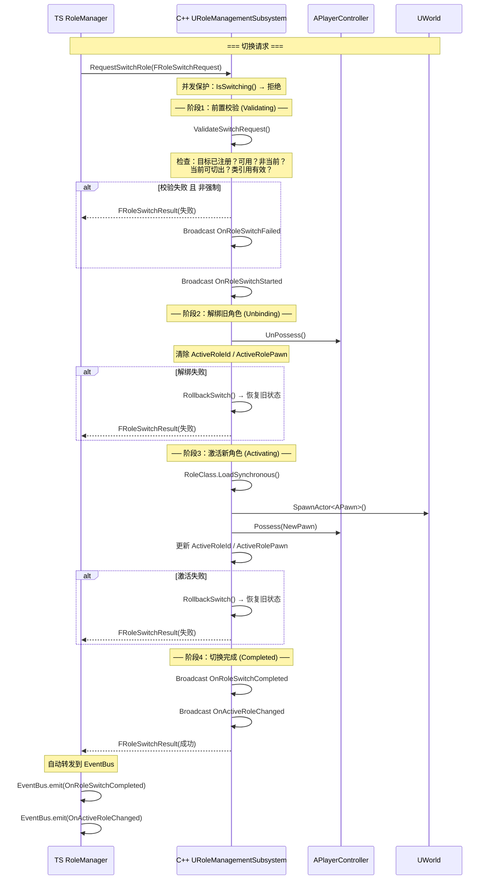
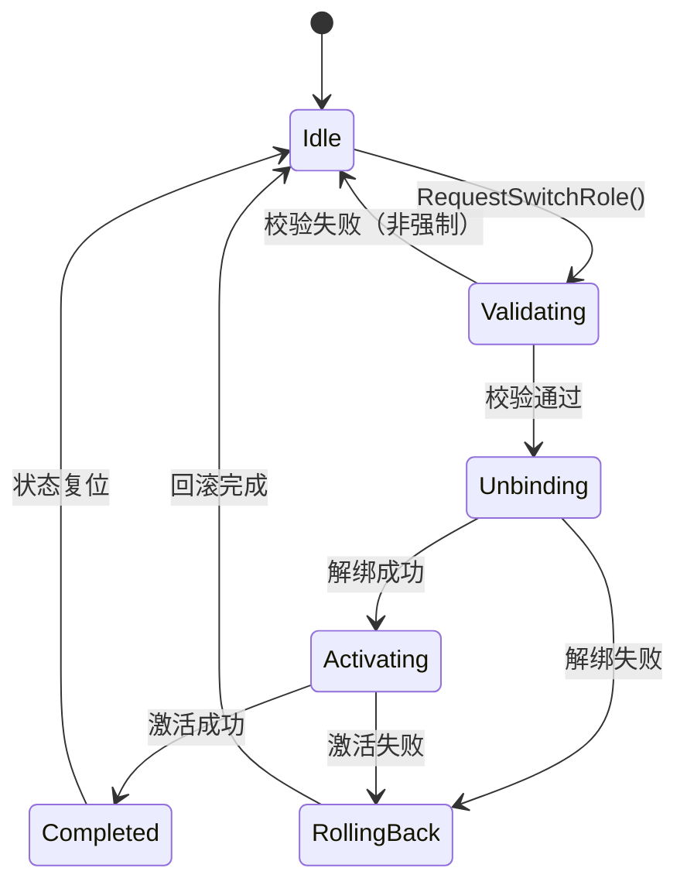
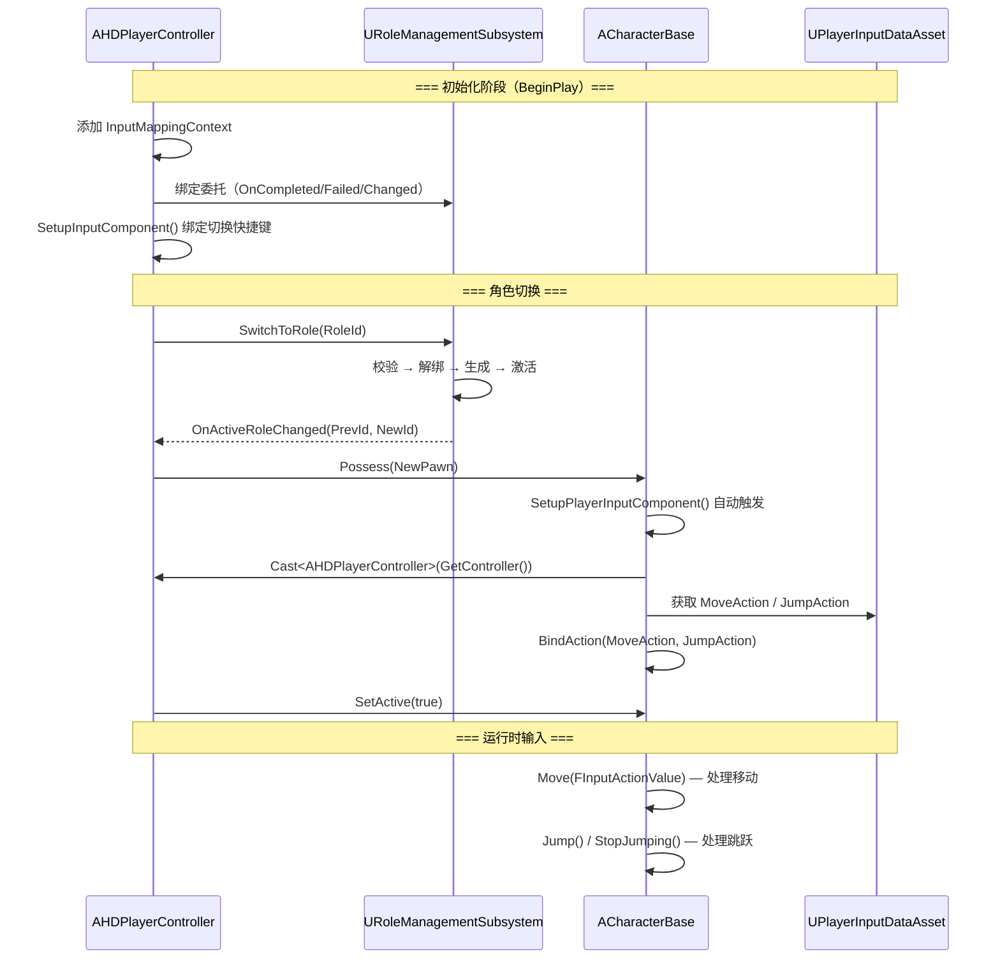

## 角色管理系统（Role Management System）

本系统提供**多角色注册、查询、切换**的完整管理能力。核心状态由 C++ `URoleManagementSubsystem` 持有，TypeScript 层通过 `RoleManager` 门面类进行桥接访问，确保**单一事实来源**在 C++ 侧。

相关源码：

**C++ 层（核心状态 & 切换流程）**
- [RoleManagementSubsystem.h](../../Source/HD_2D/RoleManagement/RoleManagementSubsystem.h)：子系统头文件（枚举、结构体、委托、接口声明）
- [RoleManagementSubsystem.cpp](../../Source/HD_2D/RoleManagement/RoleManagementSubsystem.cpp)：子系统实现（注册、查询、切换流程、回滚）

**C++ 层（角色控制 & 输入）**
- [CharacterBase.h](../../Source/HD_2D/Character/CharacterBase.h)：角色基类（继承 APaperZDCharacter，处理移动/跳跃输入）
- [CharacterBase.cpp](../../Source/HD_2D/Character/CharacterBase.cpp)：角色基类实现
- [HDPlayerController.h](../../Source/HD_2D/Character/HDPlayerController.h)：玩家控制器（管理输入上下文、角色切换快捷键、Possess 操作）
- [HDPlayerController.cpp](../../Source/HD_2D/Character/HDPlayerController.cpp)：控制器实现
- [PlayerInputDataAsset.h](../../Source/HD_2D/Character/PlayerInputDataAsset.h)：输入数据资产（统一管理所有 InputAction 配置）

**TypeScript 层（桥接 / 门面）**
- [RoleManager.ts](../Scripts/RoleManagement/RoleManager.ts)：TS 门面类，封装对 C++ Subsystem 的所有操作
- [RoleTypes.ts](../Scripts/RoleManagement/RoleTypes.ts)：TS 侧类型定义（枚举、接口，与 C++ 一一对应）
- [RoleEventTypes.ts](../Scripts/RoleManagement/RoleEventTypes.ts)：TS 侧事件常量定义

**TypeScript 层（角色逻辑）**
- [CharacterBaseLogic.ts](../Scripts/Logic/CharacterBaseLogic.ts)：角色逻辑基类（管理激活/非激活状态、后台逻辑）
- [CurrsorLogic.ts](../Scripts/Logic/CurrsorLogic.ts)：Currsor 角色专属逻辑类（示例）

## 架构概要

本系统采用 **C++ 多层架构 + TS 桥接层** 的设计：

- **C++ `URoleManagementSubsystem`**：作为 `UGameInstanceSubsystem`，随 GameInstance 生命周期存在，跨关卡持久化角色注册表和激活状态。是所有角色数据的**单一事实来源**。
- **C++ `AHDPlayerController`**：玩家控制器，管理 `InputMappingContext`、统一持有 `UPlayerInputDataAsset`（所有输入配置）、处理角色切换快捷键、监听切换事件执行 Possess 操作。
- **C++ `ACharacterBase`**：角色基类（继承 `APaperZDCharacter`），被 Possess 后自动绑定移动/跳跃输入。**角色自身不持有输入配置**，而是从控制器获取 `InputDataAsset`。
- **C++ `UPlayerInputDataAsset`**：`UDataAsset` 子类，统一存储所有 `InputAction` 配置（移动、跳跃、角色切换快捷键），仅在 `AHDPlayerController` 上配置一份。
- **TS `RoleManager`**：单例门面类，封装对 C++ Subsystem 的调用，并将 C++ 委托自动转发为 `EventBus` 事件，供其他 TS 模块监听。
- **TS `CharacterBaseLogic`**：角色逻辑基类，管理 TS 层的激活/非激活状态、后台逻辑，子类可覆写实现具体角色行为。
- **TS 不维护真实状态**，所有查询和操作最终都代理到 C++ 层。

### 架构分层

```
┌──────────────────────────────────────────────────────────┐
│  C++ 角色管理层（URoleManagementSubsystem）                │
│  角色注册表、激活状态、切换流程、Pawn 生成/回滚              │
│  作为 GameInstanceSubsystem，跨关卡持久化                  │
│  暴露 BlueprintCallable / BlueprintPure 接口              │
│  通过 Dynamic Multicast Delegate 广播事件                  │
└──────────────────┬───────────────────────────────────────┘
                   │
┌──────────────────┴───────────────────────────────────────┐
│  C++ 角色控制层                                            │
│  AHDPlayerController：InputMappingContext + 角色切换快捷键  │
│  ACharacterBase：移动/跳跃输入绑定（从控制器获取 DataAsset）  │
│  UPlayerInputDataAsset：统一存储所有 InputAction 配置       │
└──────────────────┬───────────────────────────────────────┘
                   │  PuerTS 桥接（loadUEType + SubsystemBlueprintLibrary）
                   ▼
┌──────────────────────────────────────────────────────────┐
│  TS 桥接层（RoleManager 门面）                             │
│  单例模式，封装 C++ 调用，参数/结果类型转换                 │
│  绑定 C++ 委托 → EventBus 事件转发                        │
└──────────────────┬───────────────────────────────────────┘
                   │
┌──────────────────┴───────────────────────────────────────┐
│  TS 角色逻辑层（CharacterBaseLogic / CurrsorLogic 等）      │
│  管理 TS 层激活/非激活状态、后台逻辑                        │
│  通过 EventBus 响应角色切换事件                             │
│  子类覆写实现具体角色行为（移动修饰、动画、特效等）           │
└──────────────────────────────────────────────────────────┘
```



## 设计原则

| 原则 | 说明 |
| --- | --- |
| C++ 为单一事实来源 | 角色注册表、激活状态、切换流程全部在 C++ Subsystem 中维护，TS 不缓存不复制 |
| 输入配置集中管理 | `UPlayerInputDataAsset` 仅在 `AHDPlayerController` 上配置一份，角色（`ACharacterBase`）通过 `GetController()` 获取，避免重复配置 |
| TS 为薄桥接层 | TS RoleManager 仅做参数转换、错误保护和事件转发，不包含业务逻辑 |
| C++ 处理输入，TS 处理表现 | 移动/跳跃等核心输入由 `ACharacterBase` 直接处理；TS 层 `CharacterBaseLogic` 负责动画切换、特效触发等表现逻辑 |
| 延迟初始化 | UE 环境可能在 TS 启动时尚未就绪，支持首次使用时自动重试初始化 |
| 完整的错误保护 | 所有 TS → C++ 调用均有 try-catch 包裹，C++ 侧有完整的参数校验和状态检查 |
| 事件驱动 | C++ 通过 Dynamic Delegate 广播，TS 自动转发到 EventBus，业务模块被动响应 |

## 数据结构

### 枚举

#### ERoleSwitchState（角色切换状态）

| 枚举值 | 值 | C++ 名称 | 说明 |
| --- | --- | --- | --- |
| Idle | 0 | `ERoleSwitchState::Idle` | 空闲，未在切换 |
| Validating | 1 | `ERoleSwitchState::Validating` | 正在执行前置校验 |
| Unbinding | 2 | `ERoleSwitchState::Unbinding` | 正在解绑旧角色 |
| Activating | 3 | `ERoleSwitchState::Activating` | 正在激活新角色 |
| Completed | 4 | `ERoleSwitchState::Completed` | 切换完成 |
| RollingBack | 5 | `ERoleSwitchState::RollingBack` | 切换失败，正在回滚 |

#### ERoleSwitchFailReason（角色切换失败原因）

| 枚举值 | 值 | 说明 |
| --- | --- | --- |
| None | 0 | 无失败 |
| SubsystemNotReady | 1 | 子系统未初始化 |
| TargetNotFound | 2 | 目标角色 ID 不存在 |
| TargetUnavailable | 3 | 目标角色不可用 |
| CurrentNotSwitchable | 4 | 当前角色不允许切出 |
| SwitchInProgress | 5 | 已有切换流程正在进行 |
| SameAsCurrent | 6 | 目标与当前相同 |
| ValidationFailed | 7 | 前置校验失败 |
| UnbindFailed | 8 | 解绑旧角色失败 |
| ActivateFailed | 9 | 激活新角色失败 |
| InvalidClassReference | 10 | 角色类引用无效 |
| SpawnFailed | 11 | 角色生成失败 |
| BridgeError | 100 | TS 桥接层错误（TS 侧特有） |

### 结构体

#### FRoleDefinition / IRoleDefinition（角色定义）

| 字段 | C++ 类型 | TS 类型 | 说明 |
| --- | --- | --- | --- |
| RoleId / roleId | `FName` | `string` | 角色唯一标识符 |
| DisplayName / displayName | `FText` | `string` | 角色显示名称 |
| RoleClass / roleClassPath | `TSoftClassPtr<APawn>` | `string` | 角色蓝图类引用（软引用路径） |
| SpawnTransform / spawnTransform | `FTransform` | `IRoleTransform?` | 默认生成位置 |
| bAvailable | `bool` | `boolean?` | 是否可用（默认 true） |
| bSwitchable | `bool` | `boolean?` | 是否允许被切出（默认 true） |
| AbilityTags / abilityTags | `TArray<FName>` | `string[]?` | 能力标签 |
| ExtensionData / extensionData | `TMap<FString, FString>` | `Record<string, string>?` | 扩展数据 |

#### FRoleSwitchRequest / IRoleSwitchRequest（切换请求）

| 字段 | C++ 类型 | TS 类型 | 说明 |
| --- | --- | --- | --- |
| TargetRoleId / targetRoleId | `FName` | `string` | 目标角色 ID |
| bForce | `bool` | `boolean?` | 是否强制切换（跳过前置校验） |
| RequestData / requestData | `TMap<FString, FString>` | `Record<string, string>?` | 自定义附加数据 |

#### FRoleSwitchResult / IRoleSwitchResult（切换结果）

| 字段 | C++ 类型 | TS 类型 | 说明 |
| --- | --- | --- | --- |
| bSuccess | `bool` | `boolean` | 是否切换成功 |
| FailReason / failReason | `ERoleSwitchFailReason` | `ERoleSwitchFailReason` | 失败原因 |
| PreviousRoleId / previousRoleId | `FName` | `string` | 切换前的角色 ID |
| NewRoleId / newRoleId | `FName` | `string` | 切换后的角色 ID |
| SwitchDuration / switchDuration | `float` | `number` | 切换耗时（秒） |
| FailDetail / failDetail | `FString` | `string` | 失败详情 |

## 事件系统

### C++ 委托定义

| 委托 | 参数 | 触发时机 |
| --- | --- | --- |
| `OnRoleSwitchStarted` | `const FRoleSwitchRequest&` | 切换流程启动，已通过前置校验 |
| `OnRoleSwitchCompleted` | `const FRoleSwitchResult&` | 新角色激活完成 |
| `OnRoleSwitchFailed` | `const FRoleSwitchResult&` | 切换过程中任何阶段失败 |
| `OnActiveRoleChanged` | `FName PreviousRoleId, FName NewRoleId` | 当前激活角色变更 |

### TS EventBus 事件

C++ 委托由 `RoleManager.bindDelegates()` 自动转发为 EventBus 事件：

| EventBus 事件名 | 载荷类型 | 对应 C++ 委托 |
| --- | --- | --- |
| `OnRoleSwitchStarted` | `IRoleSwitchStartedPayload` | `OnRoleSwitchStarted` |
| `OnRoleSwitchCompleted` | `IRoleSwitchEventPayload` | `OnRoleSwitchCompleted` |
| `OnRoleSwitchFailed` | `IRoleSwitchEventPayload` | `OnRoleSwitchFailed` |
| `OnActiveRoleChanged` | `IRoleChangedPayload` | `OnActiveRoleChanged` |
| `OnRoleRegistered` | `{ roleId: string }` | TS 侧扩展（无 C++ 对应） |
| `OnRoleUnregistered` | `{ roleId: string }` | TS 侧扩展（无 C++ 对应） |

### TS 侧事件监听示例

```ts
import { EventBus } from "../Mixin/EventBus";
import { RoleEventTypes } from "../RoleManagement/RoleEventTypes";
import { IRoleSwitchEventPayload, IRoleChangedPayload } from "../RoleManagement/RoleTypes";

// 在 GameObjectBase 子类中监听
export class MyLogic extends GameObjectBase {
    protected OnSetup(): void {
        this.subscribe(RoleEventTypes.OnRoleSwitchCompleted, this.onSwitchDone.bind(this));
        this.subscribe(RoleEventTypes.OnActiveRoleChanged, this.onRoleChanged.bind(this));
    }

    private onSwitchDone(payload: IRoleSwitchEventPayload): void {
        console.log(`切换完成: ${payload.result.previousRoleId} → ${payload.result.newRoleId}`);
    }

    private onRoleChanged(payload: IRoleChangedPayload): void {
        console.log(`角色变更: ${payload.previousRoleId} → ${payload.newRoleId}`);
    }
}

// 或直接通过 EventBus 监听
const bus = EventBus.getInstance();
bus.on(RoleEventTypes.OnRoleSwitchFailed, (payload: IRoleSwitchEventPayload) => {
    console.error(`切换失败: ${payload.result.failDetail}`);
});
```

## 角色切换流程

角色切换是本系统最核心的流程，采用**四阶段状态机**设计，任何阶段失败都会**自动回滚**到切换前的稳定状态。



### 切换状态机



### 回滚机制

当切换过程中任何阶段失败时，系统会自动回滚：

1. 恢复 `ActiveRoleId` 和 `ActiveRolePawn` 到切换前的值
2. 如果旧 Pawn 仍然有效，让 `PlayerController` 重新 `Possess` 旧 Pawn
3. 如果旧 Pawn 已失效，重置为空状态（无激活角色）
4. 切换状态机回到 `Idle`
5. 广播 `OnRoleSwitchFailed` 委托

## API 参考

### C++ 层（URoleManagementSubsystem）

#### 生命周期

| 方法 | 类别 | 说明 |
| --- | --- | --- |
| `IsInitialized()` | BlueprintPure | 子系统是否已完成初始化 |

#### 角色注册

| 方法 | 类别 | 参数 | 返回值 | 说明 |
| --- | --- | --- | --- | --- |
| `RegisterRole` | BlueprintCallable | `FRoleDefinition` | `bool` | 注册角色定义（不允许重复 ID） |
| `UnregisterRole` | BlueprintCallable | `FName RoleId` | `bool` | 注销角色（不允许注销当前激活角色） |
| `IsRoleRegistered` | BlueprintPure | `FName RoleId` | `bool` | 检查角色是否已注册 |

#### 角色查询

| 方法 | 类别 | 参数 | 返回值 | 说明 |
| --- | --- | --- | --- | --- |
| `GetRoleDefinition` | BlueprintPure | `FName RoleId, FRoleDefinition& Out` | `bool` | 获取角色定义 |
| `GetAllRoleDefinitions` | BlueprintPure | - | `TArray<FRoleDefinition>` | 获取所有角色定义 |
| `GetAllRoleIds` | BlueprintPure | - | `TArray<FName>` | 获取所有角色 ID |
| `GetRegisteredRoleCount` | BlueprintPure | - | `int32` | 获取已注册角色数量 |

#### 当前角色状态

| 方法 | 类别 | 返回值 | 说明 |
| --- | --- | --- | --- |
| `GetActiveRoleId` | BlueprintPure | `FName` | 当前激活角色 ID（无则 NAME_None） |
| `GetActiveRolePawn` | BlueprintPure | `APawn*` | 当前激活角色 Pawn 实例 |
| `HasActiveRole` | BlueprintPure | `bool` | 是否有激活角色 |

#### 角色切换

| 方法 | 类别 | 参数 | 返回值 | 说明 |
| --- | --- | --- | --- | --- |
| `RequestSwitchRole` | BlueprintCallable | `FRoleSwitchRequest` | `FRoleSwitchResult` | 请求切换角色（含完整校验和回滚） |
| `GetSwitchState` | BlueprintPure | - | `ERoleSwitchState` | 获取当前切换状态 |
| `IsSwitching` | BlueprintPure | - | `bool` | 是否正在执行切换 |

#### 可用性控制

| 方法 | 类别 | 参数 | 返回值 | 说明 |
| --- | --- | --- | --- | --- |
| `SetRoleAvailability` | BlueprintCallable | `FName RoleId, bool` | `bool` | 设置角色是否可用 |
| `SetRoleSwitchable` | BlueprintCallable | `FName RoleId, bool` | `bool` | 设置角色是否可被切出 |

#### 调试

| 方法 | 类别 | 说明 |
| --- | --- | --- |
| `DebugPrintStatus` | BlueprintCallable | 打印注册表和激活状态到日志 |

---

### TS 层（RoleManager）

> 通过 `RoleManager.getInstance()` 获取单例。

#### 初始化

| 方法 | 返回值 | 说明 |
| --- | --- | --- |
| `initialize()` | `boolean` | 初始化：获取 Subsystem 引用并绑定委托 |
| `isReady()` | `boolean` | 检查是否已初始化（自动重试） |

#### 角色注册

| 方法 | 参数 | 返回值 | 说明 |
| --- | --- | --- | --- |
| `registerRole(definition)` | `IRoleDefinition` | `boolean` | 注册角色定义 |
| `unregisterRole(roleId)` | `string` | `boolean` | 注销角色 |
| `isRoleRegistered(roleId)` | `string` | `boolean` | 检查角色是否已注册 |

#### 角色查询

| 方法 | 参数 | 返回值 | 说明 |
| --- | --- | --- | --- |
| `getRoleDefinition(roleId)` | `string` | `IRoleDefinition \| null` | 获取角色定义 |
| `getAllRoleIds()` | - | `string[]` | 获取所有角色 ID |
| `getRegisteredRoleCount()` | - | `number` | 获取已注册角色数量 |

#### 当前角色状态

| 方法 | 返回值 | 说明 |
| --- | --- | --- |
| `getActiveRoleId()` | `string` | 当前激活角色 ID（无则空字符串） |
| `getActiveRolePawn()` | `UE.Pawn \| null` | 当前激活角色 Pawn 实例 |
| `hasActiveRole()` | `boolean` | 是否有激活角色 |

#### 角色切换

| 方法 | 参数 | 返回值 | 说明 |
| --- | --- | --- | --- |
| `requestSwitchRole(request)` | `IRoleSwitchRequest` | `IRoleSwitchResult` | 请求切换角色 |
| `getSwitchState()` | - | `ERoleSwitchState` | 获取当前切换状态 |
| `isSwitching()` | - | `boolean` | 是否正在切换 |

#### 可用性控制

| 方法 | 参数 | 返回值 | 说明 |
| --- | --- | --- | --- |
| `setRoleAvailability(roleId, available)` | `string, boolean` | `boolean` | 设置角色是否可用 |
| `setRoleSwitchable(roleId, switchable)` | `string, boolean` | `boolean` | 设置角色是否可被切出 |

#### 调试

| 方法 | 说明 |
| --- | --- |
| `debugPrintStatus()` | 打印 C++ 和 TS 双侧状态 |

## 使用指南

### 一、注册角色

#### TS 侧

```ts
import { RoleManager } from "../RoleManagement/RoleManager";
import { IRoleDefinition } from "../RoleManagement/RoleTypes";

const roleManager = RoleManager.getInstance();

// 初始化（建议在游戏启动时调用，支持延迟重试）
roleManager.initialize();

// 注册角色
const heroDef: IRoleDefinition = {
    roleId: "Hero_Warrior",
    displayName: "战士",
    roleClassPath: "/Game/Blueprints/Characters/BP_Warrior.BP_Warrior_C",
    bAvailable: true,
    bSwitchable: true,
};
const success = roleManager.registerRole(heroDef);
console.log(`注册结果: ${success}`);
```

#### 蓝图侧

在蓝图中通过 `URoleManagementSubsystem` 节点直接调用：

```
Get Game Instance → Get Subsystem (URoleManagementSubsystem)
    → Register Role (FRoleDefinition)
```

---

### 二、切换角色

#### TS 侧

```ts
import { RoleManager } from "../RoleManagement/RoleManager";
import { IRoleSwitchRequest, ERoleSwitchFailReason } from "../RoleManagement/RoleTypes";

const roleManager = RoleManager.getInstance();

// 普通切换
const result = roleManager.requestSwitchRole({
    targetRoleId: "Hero_Mage",
});

if (result.bSuccess) {
    console.log(`切换成功: ${result.previousRoleId} → ${result.newRoleId}，耗时 ${result.switchDuration}s`);
} else {
    console.error(`切换失败: ${ERoleSwitchFailReason[result.failReason]} - ${result.failDetail}`);
}

// 强制切换（跳过前置校验）
const forceResult = roleManager.requestSwitchRole({
    targetRoleId: "Hero_Mage",
    bForce: true,
});
```

#### 蓝图侧

```
Get Subsystem (URoleManagementSubsystem)
    → Request Switch Role (FRoleSwitchRequest)
    → Branch (bSuccess)
        True: 切换成功处理
        False: 读取 FailReason / FailDetail 处理失败
```

---

### 三、监听角色事件

#### TS 侧

```ts
import { RoleEventTypes } from "../RoleManagement/RoleEventTypes";
import { IRoleSwitchEventPayload, IRoleChangedPayload } from "../RoleManagement/RoleTypes";

export class UILogic extends GameObjectBase {
    protected OnSetup(): void {
        // 监听角色变更，更新 UI
        this.subscribe(RoleEventTypes.OnActiveRoleChanged, this.onRoleChanged.bind(this));

        // 监听切换失败，显示错误提示
        this.subscribe(RoleEventTypes.OnRoleSwitchFailed, this.onSwitchFailed.bind(this));
    }

    private onRoleChanged(payload: IRoleChangedPayload): void {
        // 更新角色头像、技能栏等
        this.updateRoleUI(payload.newRoleId);
    }

    private onSwitchFailed(payload: IRoleSwitchEventPayload): void {
        // 显示切换失败提示
        this.showErrorToast(payload.result.failDetail);
    }
}
```

#### 蓝图侧

在蓝图中绑定 `URoleManagementSubsystem` 的委托：

```
Get Subsystem (URoleManagementSubsystem)
    → Bind Event to OnActiveRoleChanged
    → 回调中处理 PreviousRoleId / NewRoleId
```

---

### 四、查询角色信息

#### TS 侧

```ts
const roleManager = RoleManager.getInstance();

// 获取当前激活角色
const activeId = roleManager.getActiveRoleId();
console.log(`当前角色: ${activeId || "无"}`);

// 获取所有已注册角色
const allIds = roleManager.getAllRoleIds();
console.log(`已注册角色: ${allIds.join(", ")}`);

// 获取角色定义详情
const def = roleManager.getRoleDefinition("Hero_Warrior");
if (def) {
    console.log(`角色名: ${def.displayName}, 可用: ${def.bAvailable}`);
}

// 检查切换状态
if (roleManager.isSwitching()) {
    console.log("正在切换中...");
}
```

---

### 五、控制角色可用性

#### TS 侧

```ts
const roleManager = RoleManager.getInstance();

// 解锁新角色（设为可用）
roleManager.setRoleAvailability("Hero_Mage", true);

// 锁定角色（战斗中禁止切换）
roleManager.setRoleSwitchable("Hero_Warrior", false);

// 战斗结束后恢复
roleManager.setRoleSwitchable("Hero_Warrior", true);
```

## TS 桥接层内部机制

### Subsystem 获取策略

由于 PuerTS Normal Mode（Mixin 模式）下不会调用 `Start()`，`RoleManager` 通过以下回退策略获取 C++ Subsystem：

1. 通过 `puerts.argv.getByName("GameInstance")` 获取 GameInstance
2. 通过 `loadUEType` 加载 `URoleManagementSubsystem` 的 UClass
3. 通过 `SubsystemBlueprintLibrary.GetGameInstanceSubsystem()` 获取实例
4. 缓存结果，后续调用直接复用

### 延迟初始化

- `initialize()` 首次调用时如果 UE 环境未就绪，不会抛异常，只输出 log 级别日志
- `ensureSubsystem()` 在每次业务调用前自动检查，如果 Subsystem 可用但委托未绑定，自动补上
- 对外 API（如 `registerRole`、`requestSwitchRole`）调用 `ensureSubsystem` 确保可用性

### 类型转换

`RoleManager` 内部负责 TS 接口类型 ↔ C++ UE 结构体的双向转换：

| 方向 | 方法 | 说明 |
| --- | --- | --- |
| TS → C++ | `toUERoleDefinition()` | `IRoleDefinition` → `FRoleDefinition` |
| C++ → TS | `fromUERoleDefinition()` | `FRoleDefinition` → `IRoleDefinition` |
| C++ → TS | `fromUESwitchResult()` | `FRoleSwitchResult` → `IRoleSwitchResult` |

C++ 结构体通过 `loadUEType` + `getCachedType` 动态加载构造函数，避免硬编码依赖。

## C++ 角色控制层

角色控制层负责 **输入管理** 和 **角色 Possess 操作**，位于 `Source/HD_2D/Character/` 目录下。

### UPlayerInputDataAsset（输入数据资产）

统一存储所有 Enhanced Input 的 `InputAction` 配置，作为 `UDataAsset` 子类，仅需在 `AHDPlayerController` 蓝图上配置一份。

| 属性 | 类型 | 说明 |
| --- | --- | --- |
| `InputMappingContext` | `UInputMappingContext*` | 输入映射上下文 |
| `MoveAction` | `UInputAction*` | 移动输入动作 |
| `JumpAction` | `UInputAction*` | 跳跃输入动作 |
| `SwitchSlot1Action` | `UInputAction*` | 切换到角色槽位 1（按键 1） |
| `SwitchSlot2Action` | `UInputAction*` | 切换到角色槽位 2（按键 2） |
| `SwitchSlot3Action` | `UInputAction*` | 切换到角色槽位 3（按键 3） |
| `SwitchSlot4Action` | `UInputAction*` | 切换到角色槽位 4（按键 4） |

### ACharacterBase（角色基类）

所有可切换角色的基类，继承自 `APaperZDCharacter`。被 `AHDPlayerController` Possess 后自动绑定输入。

**核心设计：角色不持有输入配置**，在 `SetupPlayerInputComponent()` 中通过 `GetController()` 转型为 `AHDPlayerController`，获取其上的 `InputDataAsset` 来绑定输入动作。

```cpp
void ACharacterBase::SetupPlayerInputComponent(UInputComponent* PlayerInputComponent)
{
    // 从控制器获取 InputDataAsset（输入配置统一由 HDPlayerController 管理）
    AHDPlayerController* PC = Cast<AHDPlayerController>(GetController());
    UPlayerInputDataAsset* DataAsset = PC->InputDataAsset;
    
    // 绑定移动和跳跃
    EnhancedInputComponent->BindAction(DataAsset->MoveAction, ...);
    EnhancedInputComponent->BindAction(DataAsset->JumpAction, ...);
}
```

| 属性/方法 | 类别 | 说明 |
| --- | --- | --- |
| `RoleId` | UPROPERTY | 角色唯一标识符（与 RoleManagementSubsystem 中的 RoleId 对应） |
| `bIsActive` | UPROPERTY | 是否为当前激活角色 |
| `BodyHeight` | UPROPERTY | 胶囊体身体高度 |
| `SetupPlayerInputComponent()` | Override | 从控制器获取 DataAsset 绑定输入 |
| `Move(FInputActionValue)` | BlueprintCallable / Virtual | 移动处理（子类可覆写自定义移动行为） |
| `SetActive(bool)` | BlueprintCallable | 设置激活状态（控制显隐和 Tick） |

### AHDPlayerController（玩家控制器）

项目的 PlayerController，负责输入上下文管理、角色切换快捷键、监听角色管理子系统事件并执行 Possess 操作。

**核心职责**：
1. **BeginPlay** 时添加 `InputMappingContext`、绑定 `URoleManagementSubsystem` 的事件委托
2. **SetupInputComponent** 中绑定角色切换快捷键（按键 1-4 → `SwitchSlot0-3`）
3. **OnActiveRoleChanged** 回调中执行 `Possess(NewPawn)` 并设置角色激活状态
4. 支持跨关卡恢复：BeginPlay 时检查 Subsystem 是否已有激活角色，有则立即 Possess

| 方法 | 类别 | 说明 |
| --- | --- | --- |
| `SwitchToRole(RoleId, bForce)` | BlueprintCallable | 通过 RoleId 请求切换角色 |
| `SwitchToNextRole()` | BlueprintCallable | 按顺序切换到下一个角色 |
| `SwitchToPreviousRole()` | BlueprintCallable | 按顺序切换到上一个角色 |

| 配置属性 | 说明 |
| --- | --- |
| `InputMappingContext` | 输入映射上下文 |
| `InputDataAsset` | 统一输入数据资产（管理所有输入：角色移动/跳跃 + 切换快捷键） |
| `OrderedRoleIds` | 已注册角色 ID 列表（按顺序，用于按键切换） |

### 角色控制流程



## TS 角色逻辑层

TS 层的角色逻辑与 C++ 层的输入处理互补：**C++ 处理核心输入（移动/跳跃），TS 处理表现逻辑（动画、特效、状态管理）**。

### CharacterBaseLogic（角色逻辑基类）

继承 `GameObjectBase`，管理 TS 层的角色激活/非激活状态。所有具体角色逻辑应继承此类。

| 方法 | 可见性 | 说明 |
| --- | --- | --- |
| `OnSetup()` | protected | 订阅 `OnActiveRoleChanged` 和 `OnTick` 事件 |
| `OnActive()` | protected virtual | 角色被激活时回调（子类覆写实现表现逻辑） |
| `OnInactive()` | protected virtual | 角色被取消激活时回调（子类覆写） |
| `handleActiveInput(deltaTime)` | protected virtual | 激活状态下的每帧处理（子类覆写） |
| `handleBackgroundProcess(deltaTime)` | protected virtual | 非激活状态下的后台逻辑（子类覆写） |

**工作机制**：
- 订阅 `OnActiveRoleChanged` 事件，当 `payload.newRoleId === this.roleId` 时标记为激活
- `OnTick` 中根据激活状态分发到 `handleActiveInput()` 或 `handleBackgroundProcess()`

### CurrsorLogic（角色逻辑示例）

继承 `CharacterBaseLogic`，Currsor 角色的专属逻辑。演示如何在 TS 层添加角色特有行为。

```ts
export class CurrsorLogic extends CharacterBaseLogic {
    Init(owner: UE.Object): void {
        super.Init(owner);
        this.roleId = "Currsor";  // 与 C++ 侧 RoleId 对应
    }

    // 激活状态下的额外逻辑（移动速度修改、动画切换等）
    protected handleActiveInput(deltaTime: number): void { ... }

    // 非激活状态下的后台逻辑（被动技能冷却等）
    protected handleBackgroundProcess(deltaTime: number): void { ... }
}
```

### C++ / TS 职责分工

| 层级 | 职责 | 示例 |
| --- | --- | --- |
| C++ `ACharacterBase` | 核心输入处理 | 移动（`AddMovementInput`）、跳跃（`Jump`/`StopJumping`） |
| C++ `AHDPlayerController` | 输入配置管理 + 角色切换 | `InputMappingContext`、切换快捷键、`Possess` |
| TS `CharacterBaseLogic` | 状态管理 + 表现逻辑 | 激活/非激活回调、后台逻辑分发 |
| TS 具体角色逻辑 | 角色特有行为 | 移动速度修饰、动画状态切换、特效触发、被动技能 |

### 蓝图侧接入

在角色蓝图（如 `BP_Currsor`）中：

| 生命周期 | 蓝图调用 | 说明 |
| --- | --- | --- |
| BeginPlay | `InitializeLogic(self, "CurrsorLogic")` | 创建 TS 逻辑实例 |
| EventTick | `EmitEvent("OnTick", deltaTime)` | 触发每帧更新 |
| EndPlay | `DestroyLogic(logicId)` | 销毁 TS 逻辑实例 |

> **注意**：角色的 `InputDataAsset` 不再需要在每个角色蓝图上设置，只需在 `AHDPlayerController` 蓝图上配置一份即可。

## 总结

角色管理系统的核心设计是 **C++ 持有状态和处理输入，TS 桥接访问和处理表现**：

- **C++ `URoleManagementSubsystem`** 作为 `GameInstanceSubsystem`，跨关卡持久化角色注册表、激活状态、切换流程
- **C++ `AHDPlayerController`** 统一管理所有输入配置（`UPlayerInputDataAsset`），处理角色切换快捷键，监听切换事件执行 Possess
- **C++ `ACharacterBase`** 被 Possess 后自动从控制器获取输入配置，绑定移动/跳跃输入
- **TS `RoleManager`** 作为薄门面层，封装类型转换和事件转发，业务模块通过 `EventBus` 被动响应
- **TS `CharacterBaseLogic`** 管理 TS 层激活状态，分发到子类的表现逻辑方法
- 切换流程采用四阶段状态机（校验 → 解绑 → 激活 → 完成），任何阶段失败自动回滚
- 支持蓝图和 TS 双端调用，蓝图通过 BlueprintCallable/BlueprintPure 直接调用，TS 通过 RoleManager API 调用
